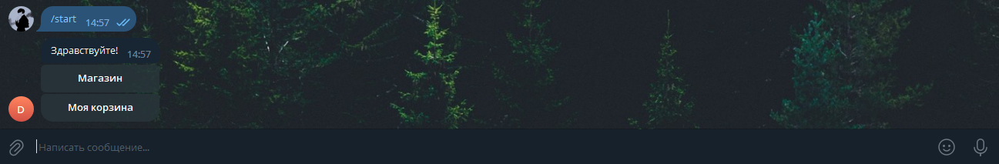
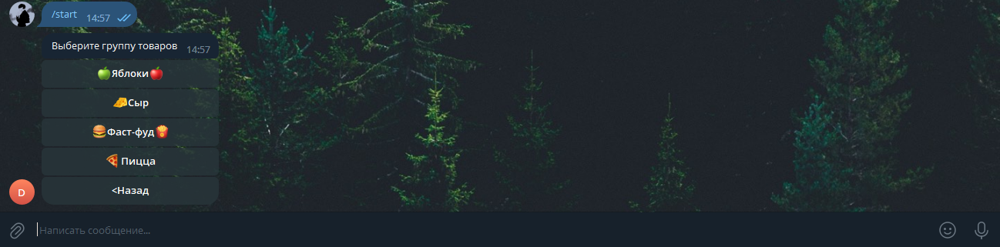
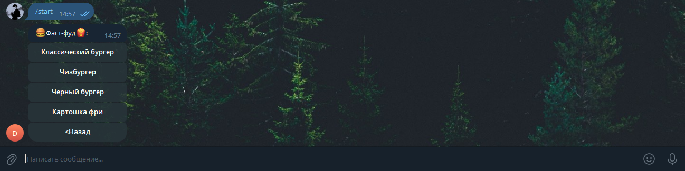
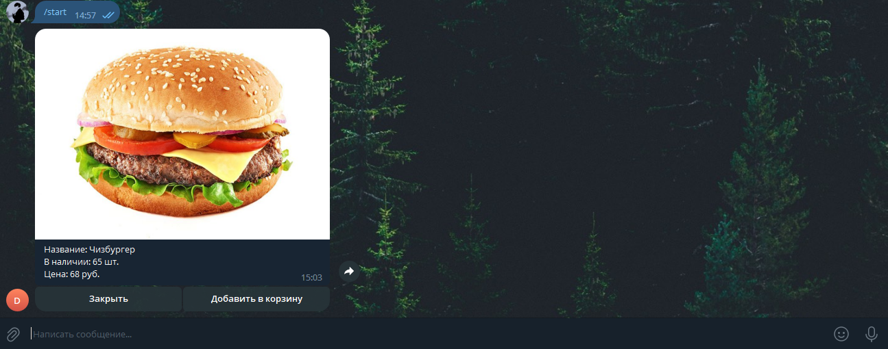
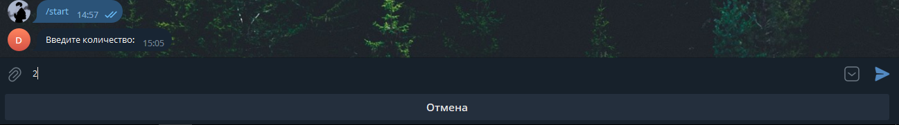
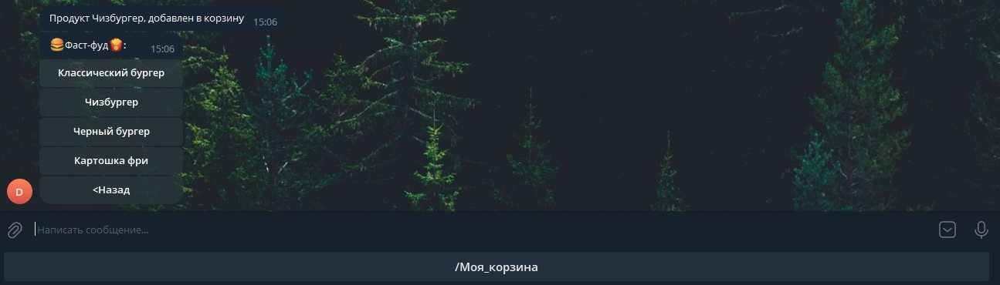
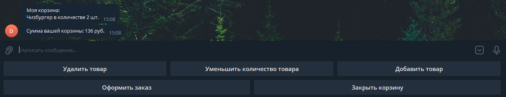
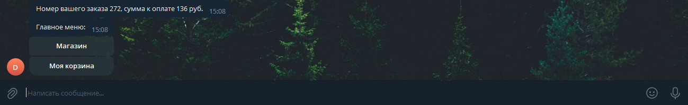

# store-bot
---
Это простой пример телеграм-бота, который позволит вам создать собственный магазин в любимом месседжере.

## Что он умеет?
***
`/start` - запускает функции для работы с клиентами.

`/moderator` - запускает админку для управления магазином.
## Пример оформления заказа
___

Запускаем бота и переходим в магазин

Далее выбираем группу товара, который хотим приобрести

После выбора группы выбираем сам товар

Для покупки товар необходимо добавить в корзину, указав при этом количество, которое необходимо купить

Перейдём в корзину чтобы оформить заказ

Оформим заказ

Таким образом работают все функции бота.

## Админка
---

Для управления ботом реализована админка, которая состоин из следующих функций:
- Добивить группу товаров
- Удалить группу товаров
- Добавить новый товар
- Добавить количество товара
- Удалить товар
- Посмотреть все заказы
- Закрыть заказ
- Посмотреть все корзины
- Очистить все корзины
